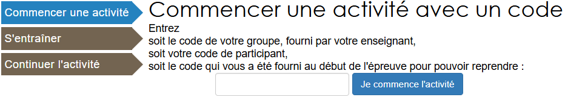

# II. Activité

## 1 - Structure des données

Rendez-vous sur la page [castor-informatique.fr]( https://concours.castor-informatique.fr/?) et :  
 - Entrez le code d'activité donné par votre professeur.  
 - Conservez le code personnel qui vous sera donné par l'activité Castor, ceci afin de pourvoir reprendre l'activité plus tard.   

 

